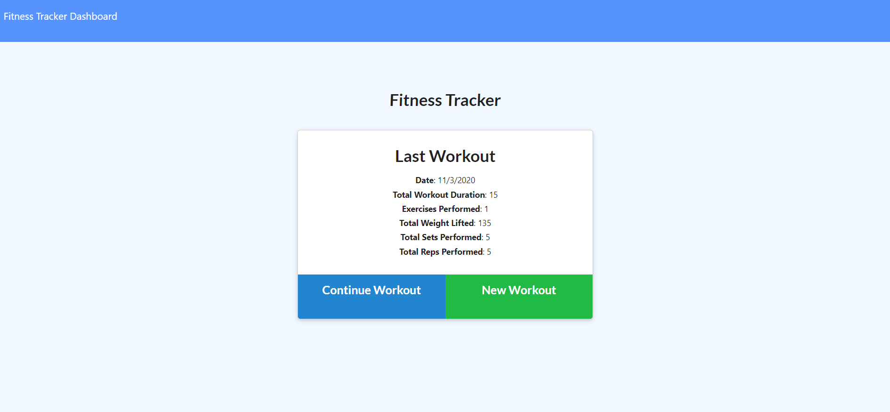
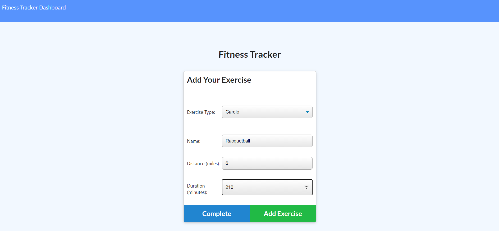
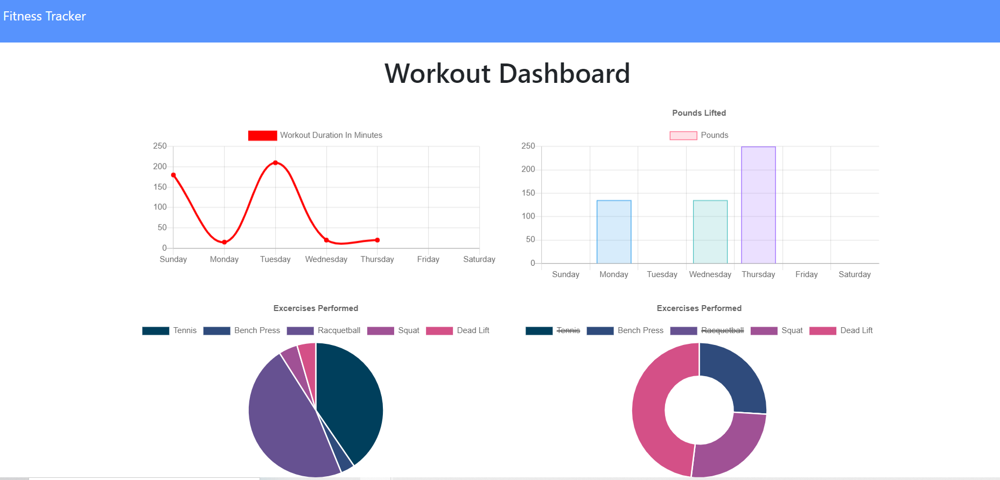

# Workout_Tracker
As a user, I want to be able to view, create, and track daily workouts. I want to be able to log multiple exercises in a workout on a given day. I should also be able to track the name, type, weight, sets, reps, and duration of exercise. If the exercise is a cardio exercise, I should be able to track my distance traveled.

Link to Heroku Deployment: https://thefitnesstracker.herokuapp.com/

Table of Contents
* [User Story](#story)
* [Images](#images)
* [Install](#install)
* [Contribution](#contribution)
* [Testing](#testing)
* [Questions](#questions)

## Story

AS A USER I want to be able to view, create, and track daily workouts.

I want to be able to log multiple exercises in a workout on a given day.

I should also be able to track the name, type, weight, sets, reps, and duration of exercise.

If the exercise is a cardio exercise, I should be able to track my distance traveled.

GIVEN a Heroku-deployed app

WHEN I run the app

THEN I see the landing page that prompts the user to either begin a new workout or continue an existing workout

WHEN I select to start a new workout

THEN I am prompted to select the type of exercise (resistance or cardio)

WHEN I select the type of exercise

THEN I am prompted to input the details of the exercise (name, weight, sets, reps, duration)

WHEN the exercise details have been added and the user clicks on 'Add Exercise'

THEN the user can add another exercise like above

WHEN the exxercise details have been added and the user clicks on 'Complete'

THEN the exercises for the day are completed

WHEN I navigate to the Dashboard

THEN I can see graphical representation of the details of the exercises added

WHEN I navigate to the Fitness Tracker Home Page

THEN I can see the details of the exercises for the day summed and listed

## Images

Fig. 1: Landing Page

Fig. 2: Add an Exercise

Fig. 3: Dashboard

## Install

Being a Heroku-deployed application, there is no installation required for the user.

Being open-source, if someone wants to dig into the nuts and bolts of this application, simply clone the repo and use the CLI to install the necessary node module packages/dependencies

It should be noted that this application utilizes MongoDB, so this should be installed separately prior to running/testing this application locally.

## Contribution

Pull requests are welcome. For major changes, please open an issue first to discuss what you would like to change.

Please make sure to update tests as appropriate.

Please contact me (chris.kabana@gmail.com) if you have something specific you would like to discuss.

## Testing

If you are investigating this code locally, testing through cli and local hosting is encouraged. If you find anything, please open an issue or contact me directly.

## Questions

If you have any questions that are not answered, please feel free to reach out to me at my email (chris.kabana@gmail.com)

You can also reach out to me on GitHub by searching for my username: dktrcoco

Or following the link: https://github.com/dktrcoco